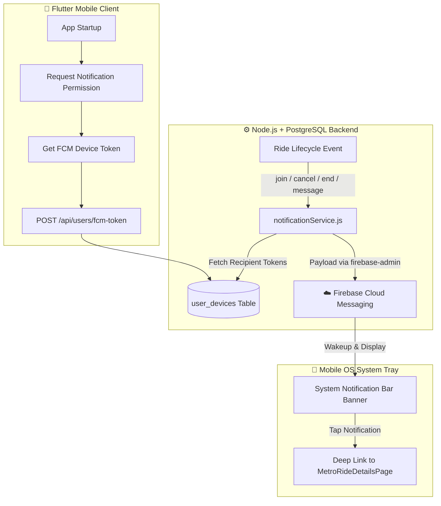

# 🔔 Firebase Cloud Messaging (FCM) Push Notifications Guide

This document records the step-by-step implementation of production-grade, 100% Free ($0) System Push Notifications for AutoMate across Flutter, Node.js, and PostgreSQL.

---

## 🏗️ Architecture & Component Flow

---

## 📋 Implementation Steps Tracker

### ✅ Step 1: Firebase Project & Android Registration
- [x] Created Firebase project (`AutoMate`).
- [x] Registered Android app with package ID: `com.example.flutter_app`.
- [x] Placed `google-services.json` in [`frontend/flutter_app/android/app/google-services.json`](file:///c:/Users/user/Desktop/AutoMate/AutoMate/frontend/flutter_app/android/app/google-services.json).

### 🔒 Security Best Practice
- `.gitignore` was configured to strictly block `serviceAccountKey.json` and `.env` files from ever being pushed to GitHub.
- On production (Render), credentials can also be read securely via Environment Variables (`FIREBASE_SERVICE_ACCOUNT`).

### ✅ Step 2: Backend Service Account Key
- [x] Placed `serviceAccountKey.json` in [`backend/src/config/serviceAccountKey.json`](file:///c:/Users/user/Desktop/AutoMate/AutoMate/backend/src/config/serviceAccountKey.json).
- [x] Verified `.gitignore` prevents secret key leakage.

### ✅ Step 3: Backend Node.js Setup
- [x] Installed `firebase-admin` SDK.
- [x] Created `user_devices` PostgreSQL table for multi-device token storage.
- [x] Added `POST /api/auth/fcm-token` endpoint.
- [x] Implemented `notificationService.js` to dispatch push alerts on ride events:
  - Host receives alert when a passenger joins (`POST /rides/join`).
  - Passengers receive alert when host completes ride (`POST /rides/end`).
  - Passengers receive alert when host cancels ride (`POST /rides/cancel`).

### ✅ Step 4: Flutter Gradle & SDK Integration
- [x] Added Google Services plugin to `android/settings.gradle.kts` and `android/app/build.gradle.kts`.
- [x] Added `firebase_core`, `firebase_messaging`, and `flutter_local_notifications` in `pubspec.yaml`.
- [x] Created `FcmService` ([`fcm_service.dart`](file:///c:/Users/user/Desktop/AutoMate/AutoMate/frontend/flutter_app/lib/services/fcm_service.dart)) with:
  - Background & terminated message handler (`@pragma('vm:entry-point')`).
  - High-priority Android notification channel (`automate_rides_channel`).
  - In-app chat suppression (suppresses notification banner if user is currently inside the active chat screen).
  - Background & foreground tap handler with automatic deep-linking to `MetroRideDetailsPage` or `ChatPage`.
- [x] Initialized Firebase & `FcmService` in `main.dart`.
- [x] Added auto-sync of FCM device token on login and app launch.

---

## 🎯 Supported Notification Events (100% Free / $0)

1. **🚗 Passenger Joins Ride (`POST /rides/join`)**:
   - Host receives instant push notification: *"New Passenger! 🚗 - [Name] joined your ride to [Destination]"*.
2. **❌ Host Cancels Ride (`POST /rides/cancel`)**:
   - All joined passengers receive push notification: *"Ride Cancelled ❌ - The host has cancelled this ride"*.
3. **🏁 Host Completes Ride (`POST /rides/end`)**:
   - All joined passengers receive push notification: *"Ride Completed! 🏁 - The host has concluded this ride"*.
4. **💬 New Chat Message (`POST /messages/send`)**:
   - All offline / background participants receive push notification: *"💬 [Sender]: [Message]"*.
   - **Smart In-Chat Suppression:** If a user is already viewing the chat screen for that ride, notification banners are suppressed so they don't block the conversation.

---

## 💰 Cost & Limits
- **Cost:** $0.00 / month permanently (Firebase Spark Free Tier).
- **Notification Quota:** Unlimited pushes per day.

