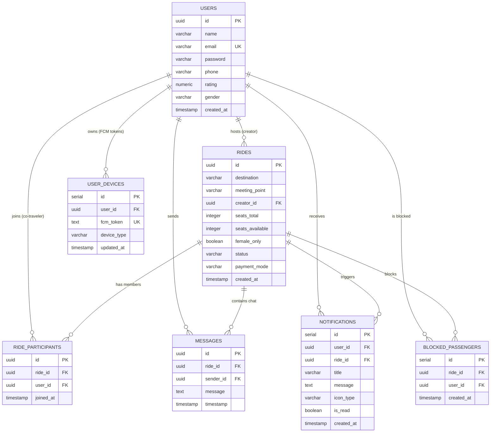
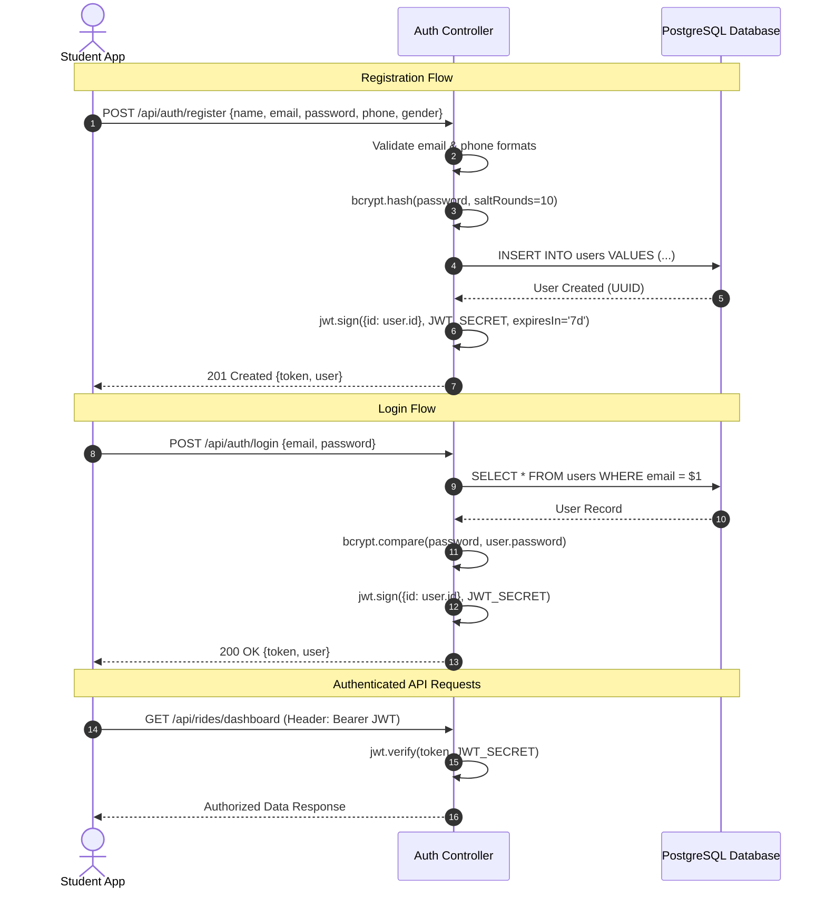
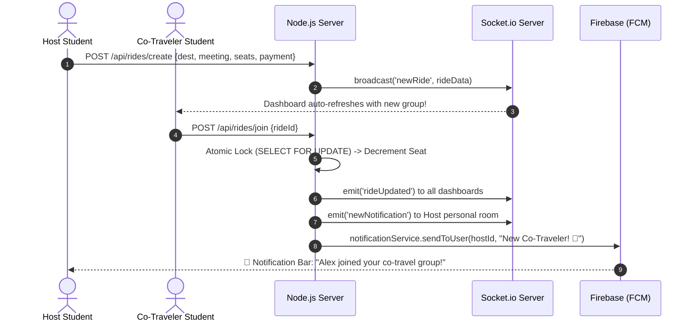
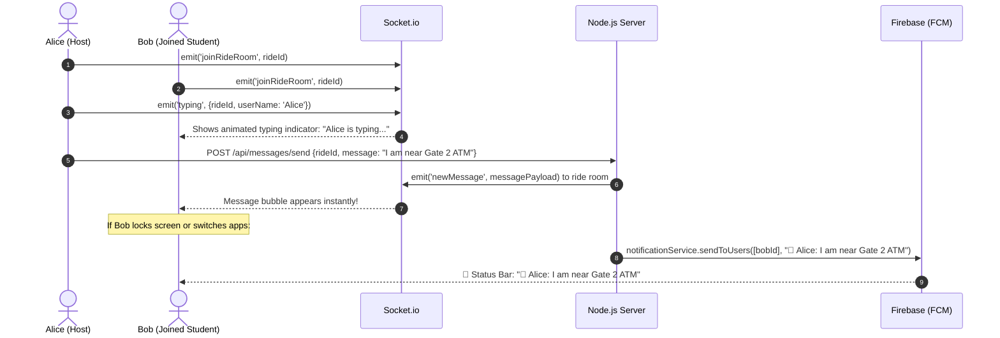

# 🚗 AutoMate — System Design & Architecture Guide

---

## 📌 Table of Contents
1. [The Real Problem & What AutoMate Is](#1-the-real-problem--what-automate-is)
2. [System Design: 4-Stage Breakdown](#2-system-design-4-stage-breakdown)
   - [Stage 1: Functional & Non-Functional Requirements](#stage-1-functional--non-functional-requirements)
   - [Stage 2: API Endpoints & Request/Response Contracts](#stage-2-api-endpoints--requestresponse-contracts)
   - [Stage 3: High-Level System Design (HLD)](#stage-3-high-level-system-design-hld)
   - [Stage 4: Detailed Low-Level Design (LLD & Scalability)](#stage-4-detailed-low-level-design-lld--scalability)
3. [Database Design & Entity Relationships](#3-database-design--entity-relationships)
4. [Authentication Flow & Security](#4-authentication-flow--security)
5. [End-to-End User Journeys](#5-end-to-end-user-journeys)
6. [Real-Time Push Notification Architecture ($0 Cost)](#6-real-time-push-notification-architecture-0-cost)
7. [Interview Quick Summary & Pitch](#7-interview-quick-summary--pitch)

---

# 1. The Real Problem & What AutoMate Is

### 🛑 The Problem with Existing Ride-Sharing (Uber / Ola / Rapido)
1. **Students Travel Alone & Pay High Fares:** Multiple students from the same college or hostel travel to the same destination (e.g., Metro Station, Railway Station, Airport, or Tech Park) at the same time, but each person books an auto/cab alone and pays the full fare.
2. **Commercial "Pool Rides" are Driver-Controlled & Overpriced:**
   * In apps like Uber/Ola Pool, the driver controls the route and stops.
   * The platform charges fixed individual fares from everyone (e.g., ₹50 + ₹50 + ₹50 = ₹150 for the platform), rather than splitting the true ₹70 total ride fare.
3. **No Safe Campus Coordination:** There is no dedicated platform for students to find trusted co-passengers heading in the same direction before booking a cab or auto.

---

### 💡 What is AutoMate?
**AutoMate** is a **Peer-to-Peer Co-Traveler & Ride-Splitting Platform** designed for students and daily commuters.

Instead of drivers creating rides:
1. **A User/Student (Organizer/Host) creates a Ride Group:** "I am heading from Campus Gate 2 to Central Metro Station at 5:00 PM. Looking for 3 co-passengers to share an Auto/Uber."
2. **Other Students Discover & Join:** Co-travelers heading to the same destination find the group and join the open seats in real time.
3. **In-App Real-Time Coordination:** The group coordinates the exact pickup landmark and timing using real-time in-app chat.
4. **Meet & Book Together on Any Platform:** Once all members meet in person, they book a single ride together on Uber, Ola, Rapido, or hail a local auto-rickshaw, splitting the total fare equally and saving up to 75% on travel costs.

---

# 2. System Design: 4-Stage Breakdown

---

## Stage 1: Functional & Non-Functional Requirements

### 🟢 A. Functional Requirements (What the system does)
1. **User Authentication:** Students register and log in securely with email, password, and phone number.
2. **Ride Group Creation (Host):** Any student can create a co-travel group specifying starting point, destination, required co-travelers (seat capacity), payment split preference (UPI / Cash), and optional female-only filter.
3. **Ride Group Discovery (Co-Travelers):** Students browse live active groups heading to their destination with live seat availability counters.
4. **Seat Booking & Leaving:** Co-travelers join a group (decrements available spots) or leave a group (frees up spot).
5. **Host Group Management:** The host can cancel the group, end/complete the ride once reached, remove a member, or block an abusive user.
6. **Real-Time Group Chat:** Active members coordinate meeting spots with live messaging, delivery ticks, and real-time typing indicators.
7. **System Push Notifications:** Sends instant mobile notifications to backgrounded devices when someone joins, leaves, completes a group, or sends a chat message.
8. **User Profile & Stats:** Displays lifetime travel stats (groups hosted vs. groups joined) and user ratings.

---

### 🔵 B. Non-Functional Requirements (How well the system performs)
1. **Zero Seat Overbooking (Concurrency Safety):** If two students click "Join" at the exact same millisecond for the last open spot, only one gets it. Overbooking is mathematically impossible.
2. **Ultra-Low Latency:** Dashboard and search queries return in under 100ms.
3. **Real-Time Sockets:** Chat messages and group status changes reflect across devices in ~200ms.
4. **Data Integrity (ACID):** Seat counts, participant tables, and group states are updated atomically inside database transactions.
5. **$0 Infrastructure Cost:** Built entirely on free-tier services (Render Web Service + Managed PostgreSQL + Firebase Cloud Messaging Spark Tier).
6. **Battery & Data Efficient:** Sockets disconnect when leaves the page, and network payloads are Gzip-compressed.

---

## Stage 2: API Endpoints & Request/Response Contracts

All protected routes require an `Authorization: Bearer <JWT_TOKEN>` header.

```
┌─────────────────────────────────────────────────────────────────────────────────┐
│                              API ENDPOINTS SUMMARY                              │
├───────────────────┬─────────────────────────────┬───────────────────────────────┤
│ Module            │ Method & Path               │ Description                   │
├───────────────────┼─────────────────────────────┼───────────────────────────────┤
│ Auth              │ POST /api/auth/register     │ Register student account      │
│ Auth              │ POST /api/auth/login        │ Authenticate & receive JWT    │
│ Auth              │ GET  /api/auth/me           │ Fetch current student profile │
│ Auth              │ POST /api/auth/fcm-token    │ Register/refresh device token │
│ Rides (Groups)    │ GET  /api/rides/dashboard   │ ⚡ 1-Flight BFF dashboard load │
│ Rides (Groups)    │ POST /api/rides/create      │ Create a new co-travel group  │
│ Rides (Groups)    │ GET  /api/rides/nearby      │ List active co-travel groups  │
│ Rides (Groups)    │ GET  /api/rides/:id         │ Get single group details      │
│ Rides (Groups)    │ POST /api/rides/join        │ Join group (concurrency-safe) │
│ Rides (Groups)    │ POST /api/rides/leave       │ Leave a joined group          │
│ Rides (Groups)    │ POST /api/rides/cancel      │ Host cancels group            │
│ Rides (Groups)    │ POST /api/rides/end         │ Host marks group as completed │
│ Rides (Groups)    │ POST /api/rides/:id/remove  │ Host removes a member         │
│ Rides (Groups)    │ POST /api/rides/:id/block   │ Host blocks a user            │
│ Rides (Groups)    │ GET  /api/rides/history     │ Get past completed rides      │
│ Messages          │ GET  /api/messages/:rideId  │ Fetch group chat history      │
│ Messages          │ POST /api/messages/send     │ Send chat message             │
│ Notifications     │ GET  /api/notifications     │ Fetch notification feed       │
│ Notifications     │ PUT  /api/notifications/read│ Mark notification read        │
└───────────────────┴─────────────────────────────┴───────────────────────────────┘
```

### Key API Contracts

#### 1. `POST /api/rides/create` (Create Co-Travel Group)
* **Request:**
```json
{
  "destination": "Central Metro Station",
  "meetingPoint": "Campus Gate 2",
  "seatsTotal": 3,
  "paymentMode": "Split via UPI",
  "femaleOnly": false
}
```
* **Response (201 Created):**
```json
{
  "message": "Ride group created successfully!",
  "ride": {
    "id": "9b1deb4d-3b7d-4bad-9bdd-2b0d7b3dcb6d",
    "creator_id": "2a4b1b53-ee0f-4199-bee6-f7ffbcc17d62",
    "destination": "Central Metro Station",
    "meeting_point": "Campus Gate 2",
    "seats_total": 3,
    "seats_available": 3,
    "status": "active"
  }
}
```

#### 2. `GET /api/rides/dashboard` (Consolidated BFF Endpoint)
* **Response (200 OK):**
```json
{
  "user": { "id": "2a4b...", "name": "Alex", "email": "alex@uni.edu" },
  "activeJoinedRide": {
    "id": "9b1deb4d-3b7d-4bad-9bdd-2b0d7b3dcb6d",
    "destination": "Central Metro Station",
    "meeting_point": "Campus Gate 2",
    "seats_available": 1,
    "seats_total": 3,
    "status": "active"
  },
  "availableRides": [
    {
      "id": "e4d2...",
      "creator_name": "Sarah",
      "destination": "Tech Park",
      "meeting_point": "Library Circle",
      "seats_available": 2,
      "seats_total": 3,
      "payment_mode": "Split via UPI",
      "female_only": false
    }
  ],
  "unreadNotifications": false
}
```

#### 3. `POST /api/rides/join` (Join Group)
* **Request:**
```json
{
  "rideId": "9b1deb4d-3b7d-4bad-9bdd-2b0d7b3dcb6d"
}
```
* **Response (200 OK):**
```json
{
  "message": "Successfully joined the co-travel group!",
  "seatsRemaining": 1
}
```

---

## Stage 3: High-Level System Design (HLD)

The system uses a 3-tier client-server architecture:

```mermaid
graph TD
    subgraph Client Layer (Flutter Mobile App)
        UI[Flutter UI - Student Mobile App]
        FCM_CLIENT[Firebase Messaging Client]
        SOCK_CLIENT[Socket.io Real-Time Client]
    end

    subgraph Server Layer (Node.js & Express on Render)
        API_GATEWAY[Express REST API Gateway]
        AUTH_MW[JWT Auth Middleware]
        RIDE_SVC[Co-Travel Group Controller]
        MSG_SVC[Group Chat Controller]
        SOCK_SERVER[Socket.io Real-Time Server]
        FCM_SVC[Firebase Admin Push Service]
    end

    subgraph Data & Cloud Services
        PG[(PostgreSQL Managed DB)]
        FCM_CLOUD[Google Firebase FCM Cloud]
    end

    UI -->|HTTPS REST Requests| API_GATEWAY
    API_GATEWAY --> AUTH_MW
    AUTH_MW --> RIDE_SVC
    AUTH_MW --> MSG_SVC

    SOCK_CLIENT <-->|WSS WebSockets| SOCK_SERVER
    
    RIDE_SVC -->|SQL Queries with Pool| PG
    MSG_SVC -->|SQL Queries with Pool| PG

    RIDE_SVC -->|Trigger Push| FCM_SVC
    MSG_SVC -->|Trigger Push| FCM_SVC
    FCM_SVC -->|Multicast HTTP v1| FCM_CLOUD
    FCM_CLOUD -->|Status Bar Alerts| FCM_CLIENT
```

---

## Stage 4: Detailed Low-Level Design (LLD & Scalability)

```
┌──────────────────────────────────────────────────────────────────────────────┐
│                     LLD RELIABILITY & PERFORMANCE PATTERNS                   │
├──────────────────────────────────────────────────────────────────────────────┤
│ 1. Atomic Row-Level Locking (`SELECT FOR UPDATE`) ➔ Prevents Overbooking      │
│ 2. Single-Flight BFF Aggregation ➔ Cuts 4 Network Trips Down to 1            │
│ 3. Set-Based Atomic SQL ➔ Eliminates N+1 Query Loops                         │
│ 4. Connection Pool Hardening (`max: 10`, 30s timeout) ➔ Prevents DB Leaks    │
│ 5. Gzip Payload Compression ➔ 70% Less Mobile Bandwidth Consumption          │
│ 6. Room-Isolated WebSocket Relays ➔ Zero Cross-Chat Data Leaks               │
└──────────────────────────────────────────────────────────────────────────────┘
```

### 1. Concurrency Lock: Preventing Seat Overbooking
When 2 students attempt to join the last remaining spot at the exact same millisecond:

```sql
BEGIN;

-- 1. Acquire an exclusive row-level lock on the ride group
SELECT * FROM rides WHERE id = $1 FOR UPDATE;

-- 2. Verify seat availability inside the lock
-- If seats_available <= 0 -> ROLLBACK and throw Error 400 ("Group is full")

-- 3. Register the student in the participants table
INSERT INTO ride_participants (ride_id, user_id) VALUES ($1, $2);

-- 4. Decrement available seats atomically
UPDATE rides 
SET seats_available = seats_available - 1,
    status = CASE WHEN seats_available - 1 = 0 THEN 'full' ELSE 'active' END
WHERE id = $1;

COMMIT;
```

---

### 2. Eliminating $N+1$ Database Query Loops
* **The Problem:** If a user leaves or cleans up multiple groups, running `DELETE` or `UPDATE` in a JavaScript `forEach` loop executes $N$ individual network round-trips to PostgreSQL.
* **AutoMate's Solution:** Single set-based atomic SQL query:
```sql
UPDATE rides 
SET seats_available = seats_available + 1, status = 'active'
WHERE id IN (
  SELECT rp.ride_id FROM ride_participants rp
  JOIN rides r ON rp.ride_id = r.id
  WHERE rp.user_id = $1 AND r.status IN ('active', 'full')
);
DELETE FROM ride_participants WHERE user_id = $1;
```

---

# 3. Database Design & Entity Relationships

AutoMate uses a relational **PostgreSQL** schema enforcing referential integrity with cascading deletes:



### High-Performance Database Indexes
```sql
CREATE INDEX idx_rides_status_created_at ON rides(status, created_at DESC);
CREATE INDEX idx_rides_creator_id ON rides(creator_id);
CREATE INDEX idx_ride_participants_ride_id ON ride_participants(ride_id);
CREATE INDEX idx_ride_participants_user_id ON ride_participants(user_id);
CREATE INDEX idx_messages_ride_id ON messages(ride_id, timestamp ASC);
CREATE INDEX idx_user_devices_user_id ON user_devices(user_id);
```

---

# 4. Authentication Flow & Security

AutoMate uses stateless **JSON Web Tokens (JWT)** with salted **Bcrypt** password hashing:



---

# 5. End-to-End User Journeys

### A. Student Creates a Group & Co-Travelers Join


---

### B. Real-Time Chat & Meeting Coordination


---

### C. Meeting in Person & Booking on Other Platforms
```
1. Students meet at the designated pickup landmark (e.g. Campus Gate 2).
2. Host or any member opens Uber / Ola / Rapido or hails an Auto-rickshaw.
3. Total fare is split equally among all members (e.g. ₹150 total / 3 students = ₹50 each).
4. Host taps "Complete Ride" on AutoMate to archive the session.
```

---

# 6. Real-Time Push Notification Architecture ($0 Cost)

AutoMate delivers system notifications across Android status bars at **$0.00 / month cost**:

```mermaid
graph TD
    subgraph Trigger Events
        E1[Student Joins Group]
        E2[Host Cancels Group]
        E3[Host Completes Ride]
        E4[New Chat Message]
    end

    subgraph Backend Push Dispatcher
        NS[notificationService.js]
        DB_DEV[(user_devices table)]
        FCM_ADMIN[Firebase Admin Messaging SDK]
    end

    subgraph Firebase Cloud
        GOOGLE_FCM[Google FCM Free Spark Tier]
    end

    subgraph Mobile Client (Flutter)
        SYS_BAR[Android Status Bar Alert]
        DEEP_LINK[Deep Link Handler]
        CHAT_UI[Chat Page]
        RIDE_UI[Ride Details Page]
    end

    E1 & E2 & E3 & E4 --> NS
    NS -->|Query User FCM Tokens| DB_DEV
    NS -->|Multicast Message Payload| FCM_ADMIN
    FCM_ADMIN -->|Push Request| GOOGLE_FCM
    GOOGLE_FCM -->|Deliver Notification| SYS_BAR

    SYS_BAR -->|User Taps Notification| DEEP_LINK
    DEEP_LINK -->|If type == CHAT_MESSAGE| CHAT_UI
    DEEP_LINK -->|If type == RIDE_JOIN/CANCEL/END| RIDE_UI
```

---

# 7. Interview Quick Summary & Pitch

When explaining AutoMate to an interviewer, deliver this clear pitch:

> **"AutoMate is a peer-to-peer co-traveler platform for students and commuters.** 
> 
> **Instead of paying high solo fares or using driver-controlled pool rides where platforms overcharge each passenger, AutoMate lets students heading to the same destination form a group in real time.** 
> 
> **They coordinate meeting points using in-app live chat, meet at the campus gate, and book a single ride together on Uber/Ola/Auto — splitting the true fare equally and saving up to 75%.**
> 
> **Technically, the app is built with Flutter, Node.js/Express, PostgreSQL, and Socket.io. I designed a race-condition-safe booking system using atomic database row locks (`SELECT FOR UPDATE`), optimized mobile latency with a Backend-For-Frontend (BFF) architecture, and implemented a zero-cost real-time push notification pipeline with Firebase Cloud Messaging."**
